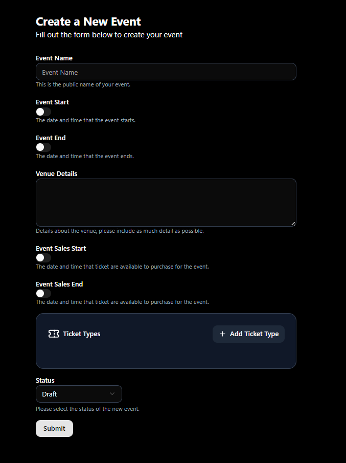
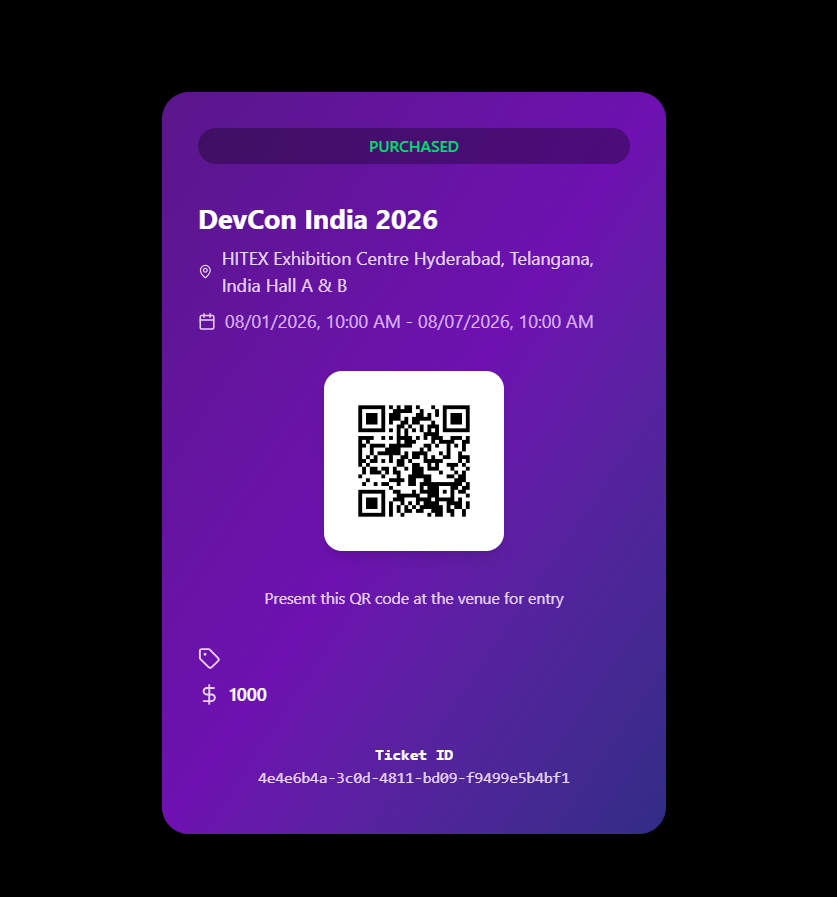

# EventTix - Event Ticketing Platform

A Spring Boot backend for managing the full lifecycle of event ticket sales — event creation, ticket purchasing, QR code generation, and staff-side entry validation — secured with role-based OAuth2 authentication via Keycloak.

## About the Project

Organizers create and manage events, attendees browse and purchase tickets, and staff validate entry at the door using QR codes. The service is built as a production-style backend with a focus on correct concurrency handling (no overselling), clean security boundaries between roles, and a domain model that reflects real ticketing constraints.

## Features

- **Event management** — create, update, list, and delete events, including sales windows (`salesStart` / `salesEnd`) and venue details.
- **Ticket types** — each event can define multiple ticket tiers (e.g. General, VIP) with independent pricing and capacity.
- **Public event discovery** — published events can be browsed with no authentication required.
- **Ticket purchasing** — authenticated users purchase tickets against a ticket type, with built-in sold-out protection.
- **QR code generation** — every purchased ticket receives a unique QR code (via ZXing) used for entry.
- **Ticket validation** — staff scan a ticket's QR code (or validate manually) at the door; re-scanning an already-validated ticket is flagged invalid, preventing ticket sharing/reuse.
- **Role-based access control** — `ORGANIZER`, `STAFF`, and public/attendee access enforced centrally in the security configuration.

## User Roles (Keycloak)

The system uses Keycloak to manage three distinct roles:

### 1. Organiser
*   Full power to create, update, and manage events.
*   Ability to create different ticket types (e.g., VIP, General Admission, Early Bird) with custom pricing and capacity.

### 2. Attendee
*   Can browse available events.
*   Can purchase tickets.
*   Receives a unique QR code with one-time validity for every ticket purchased.

### 3. Staff
*   Can view event details they are assigned to.
*   Access to an in-built QR scanner tool to validate attendee tickets upon entry.

## Tech Stack

| Layer | Technology |
|---|---|
| Language / Framework | Java 21, Spring Boot 3.4.4 |
| Persistence | PostgreSQL, Spring Data JPA |
| Auth | Keycloak, OAuth2 Resource Server, JWT |
| Object Mapping | MapStruct, Lombok |
| QR Code Generation | ZXing (Google) |
| Infrastructure | Docker Compose (PostgreSQL, Adminer, Keycloak) |
| Build | Maven |

## Implementation Highlights

### JWT → Roles Pipeline
A custom `JwtAuthenticationConverter` extracts the `realm_access.roles` claim from the Keycloak-issued JWT and maps it to Spring Security `GrantedAuthority` objects, enabling declarative checks like `hasRole("ORGANIZER")` in `SecurityConfig`.

### Just-In-Time User Provisioning
`UserProvisioningFilter`, a `OncePerRequestFilter`, runs immediately after JWT authentication. On a user's first request, it reads the `sub`, `preferred_username`, and `email` claims and auto-creates a local `User` record — no separate signup flow needed, and identity provider concerns stay cleanly separated from domain data.

### Concurrency-Safe Ticket Purchasing
`TicketTypeServiceImpl.purchaseTicket()` uses a repository method annotated with `@Lock(LockModeType.PESSIMISTIC_WRITE)` to row-lock the `TicketType` before counting existing tickets against total capacity. This prevents two simultaneous purchase requests from both reading "available" and both succeeding — the second transaction waits for the first to commit, then re-validates capacity.

### Centralized Error Handling
`GlobalExceptionHandler` maps all domain exceptions (`TicketsSoldOutException`, `TicketNotFoundException`, `EventNotFoundException`, `QrCodeGenerationException`, etc.) to consistent HTTP error responses.

## Backend Architecture Details

The Spring Boot backend is structured into several layers for clean separation of concerns:

*   **Entities / Tables (6):** `Event`, `QrCode`, `Ticket`, `TicketType`, `TicketValidation`, `User`.
*   **Repositories (6):** `EventRepository`, `QrCodeRepository`, `TicketRepository`, `TicketTypeRepository`, `TicketValidationRepository`, `UserRepository`.
*   **Services (5):** `EventService`, `QrCodeService`, `TicketService`, `TicketTypeService`, `TicketValidationService`.
*   **Controllers / Endpoints (5):** `EventController`, `PublishedEventController`, `TicketController`, `TicketTypeController`, `TicketValidationController`.
*   **Configs (4):** `JpaConfiguration`, `JwtAuthenticationConverter`, `QrCodeConfig`, `SecurityConfig`.
*   **Mappers (3):** `EventMapper`, `TicketMapper`, `TicketValidationMapper`.
*   **Filters (1):** `UserProvisioningFilter`.
*   **Exceptions:** Custom exceptions like `EventNotFoundException`, `TicketsSoldOutException`, `QrCodeNotFoundException`, `UserNotFoundException`, `EventTicketException`, etc., are handled by a `GlobalExceptionHandler`.

## Infrastructure & Docker

The project uses Docker and Docker Compose (`docker-compose.yml`) to seamlessly spin up the required infrastructure:

*   **PostgreSQL:** The main relational database for storing all application data.
*   **Keycloak:** Manages authentication, authorization, and user roles (Organiser, Attendee, Staff).
*   **Adminer:** A lightweight database management interface (accessible via port 8888) to easily inspect and interact with the PostgreSQL database during development.

## End-to-End Flow

1. Organizer creates an `Event` and defines its `TicketType`(s).
2. Public users browse published events (no auth required).
3. An authenticated user purchases a ticket — processed under a pessimistic lock.
4. A QR code is generated for the new ticket and stored as base64.
5. At the venue, staff scan the QR code (or validate manually); re-scans of an already-validated ticket are marked invalid.

## Project Images

*Organiser dashboard for managing events and ticket types.*

*Example of a one-time valid QR code ticket generated for attendees.*

*Built-in QR scanner tool used by staff.*
